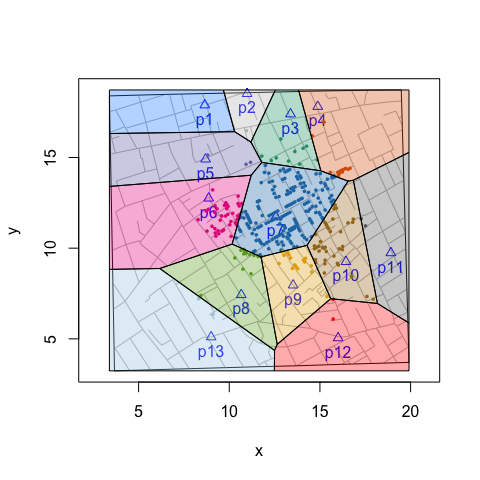

<!-- README.md is generated from README.Rmd. Please edit that file -->

[](https://github.com/lindbrook/voronoiPolygons/blob/master/NEWS)

## voronoiPolygons: tiles, triangles and polygons

NOTE: this function available is also available in the ‘cholera’
package.

CRAN: <https://CRAN.R-project.org/package=cholera/>  
GitHub: <https://github.com/lindbrook/cholera/>

------------------------------------------------------------------------

Using just the locations of sites or landmarks, Voronoi tessellation
partitions a space into cells or tiles that represent those sites’
neighborhoods (i.e., their catchment or service areas). In contrast,
Delaunay triangulation connects sites to all their first order neighbors
and partitions the space defined by the sites on the perimeter into
triangles.

This package adds to the functionality of the ‘deldir’ package by
computing the vertices of those tiles and traingles so that we can
leverage functions that use polygons. Doing so simplifies tasks like
color coding tiles (or triangles) or counting elements of interest
within tiles (or triangles).

As an example, I use data from John Snow’s map of the 1854 cholera
outbreak in the Soho area London.

## Coloring Tiles

``` r
# compute vertices of Voronoi tiles
vertices <- voronoiPolygons(sites = cholera::pumps,
  rw.data = cholera::roads)

# define colors, plot map, and color code fatalities
snow.colors <- grDevices::adjustcolor(cholera::snowColors(),
  alpha.f = 1/3)
cholera::snowMap(add.cases = FALSE)
cholera::addNeighborhoodCases(metric = "euclidean")

# plot color coded polygons
invisible(lapply(seq_along(vertices), function(i) {
  polygon(vertices[[i]], col = snow.colors[[i]])
}))
```



## Counting Observations in Tiles

To count the number of cases within each neighborhood, we can use
sp::point.in.polygon().

``` r
# compute vertices of Voronoi tiles
vertices <- voronoiPolygons(sites = cholera::pumps,
  rw.data = cholera::roads)

# locations of the 578 fatalities in Soho
cases <- cholera::fatalities.unstacked

# count fatalities within each polygon (neigborhood)
census <- lapply(vertices, function(tile) {
  sp::point.in.polygon(cases$x, cases$y, tile$x, tile$y)
})

# ID the 13 water pumps
names(census) <- paste0("p", cholera::pumps$id)

# count of fatalities by neighborhood
vapply(census, sum, integer(1L))
>  p1  p2  p3  p4  p5  p6  p7  p8  p9 p10 p11 p12 p13 
>   0   1  13  23   6  61 361  16  27  62   2   2   4
```

## Counting Observations in Triangles

To count the number of cases within each triangle:

``` r
# compute vertices of Delaunay triangles
vertices <- voronoiPolygons(sites = cholera::pumps,
  rw.data = cholera::roads, type = "triangles")

# locations of the 578 fatalities in Soho
cases <- cholera::fatalities.unstacked

# count fatalities within each triangle
census <- lapply(vertices, function(tile) {
  sp::point.in.polygon(cases$x, cases$y, tile$x, tile$y)
})

# ID triangles
names(census) <- paste0("t", seq_along(vertices))

# count of fatalities by triangle
vapply(census, sum, integer(1L))
>  t1  t2  t3  t4  t5  t6  t7  t8  t9 t10 t11 t12 t13 t14 t15 t16 t17 
>   1   0   1  11  43 179  35   2  18 138  15  22  97   0   0   4   1
```

### getting started

You can install the current development version of ‘voronoiPolygons’
from GitHub:

``` r
# Note that you may need to install the 'devtools' package:
# install.packages("devtools")

# For 'devtools' (< 2.0.0)
devtools::install_github("lindbrook/voronoiPolygons", build_vignettes = TRUE)

# For 'devtools' (>= 2.0.0)
devtools::install_github("lindbrook/voronoiPolygons", build_opts = c("--no-resave-data", "--no-manual"))
```
