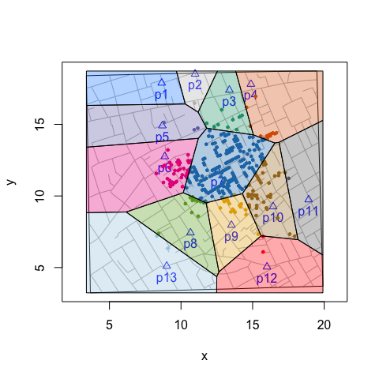

<!-- README.md is generated from README.Rmd. Please edit that file -->
[](https://github.com/lindbrook/VoronoiPolygons/blob/master/NEWS)

VoronoiPolygons: from tiles to polygons
---------------------------------------

Using just the locations of sites or landmarks, Voronoi tessellation partitions a space into cells or tiles that represent those sites' neighborhoods (i.e., their catchment or service areas). This package adds to the functionality of the 'deldir' package by computing the vertices of those tiles so that we can leverage functions that use polygons. Doing so simplifies tasks like color coding neighborhoods or counting elements of interest within neighborhoods.

As an example, I use data from John Snow's map of the 1854 cholera outbreak in the Soho area London.

Coloring Polygons
-----------------

``` r
# compute vertices of Voronoi tiles
polygon.vertices <- deldirPolygons(sites = cholera::pumps,
  rw.data = cholera::roads)

# define colors, plot map, and color code fatalities
snow.colors <- grDevices::adjustcolor(cholera::snowColors(), alpha.f = 1/3)
cholera::snowMap(add.cases = FALSE)
cholera::addNeighborhoodCases(metric = "euclidean")

# plot color coded polygons
invisible(lapply(seq_along(polygon.vertices), function(i) {
  polygon(polygon.vertices[[i]], col = snow.colors[[i]])
}))
```



Counting Observations in Polygons
---------------------------------

To count the number of cases within each neighborhood, we can use sp::point.in.polygon().

``` r
# compute vertices of Voronoi tiles
polygon.vertices <- deldirPolygons(sites = cholera::pumps,
  rw.data = cholera::roads)

# locations of the 578 fatalities in Soho
cases <- cholera::fatalities.unstacked

# count fatalities within each polygon (neigborhood)
census <- lapply(polygon.vertices, function(tile) {
  sp::point.in.polygon(cases$x, cases$y, tile$x, tile$y)
})

# ID the 13 water pumps
names(census) <- paste0("p", cholera::pumps$id)

# count of fatalities by neighborhood
vapply(census, sum, integer(1L))
#>  p1  p2  p3  p4  p5  p6  p7  p8  p9 p10 p11 p12 p13 
#>   0   1  13  23   6  61 361  16  27  62   2   2   4
```

### getting started

You can install the current development version of 'VoronoiPolygons' from GitHub:

``` r
# Note that you may need to install the 'devtools' package:
# install.packages("devtools")

# For 'devtools' (< 2.0.0)
devtools::install_github("lindbrook/VoronoiPolygons", build_vignettes = TRUE)

# For 'devtools' (>= 2.0.0)
devtools::install_github("lindbrook/VoronoiPolygons", build_opts = c("--no-resave-data", "--no-manual"))
```
